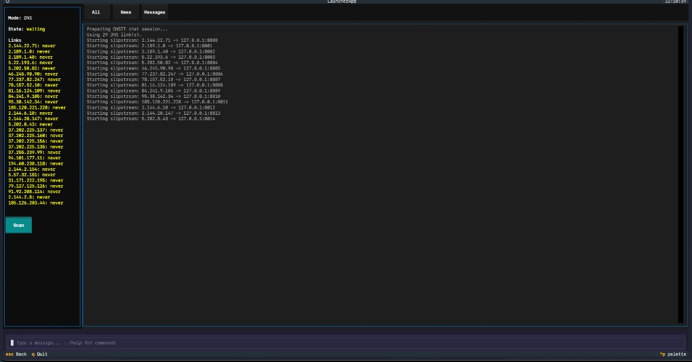

# chat-over-slip

Terminal and desktop chat over **SSH** or **DNS tunneling** (dnstt / [Slipstream](https://github.com/Mygod/slipstream-rust)). This repo is the chat client/launcher and server-side [`chat.sh`](chat.sh) log; the tunnel itself is provided by Slipstream (Rust) or your existing dnstt stack.

---

## How the application works

Every client is a **local UI** that drives a **remote message log** on your server. The remote side is a normal directory containing [`chat.sh`](chat.sh) (append/read/clear messages, optional Telegram hooks, news import, etc.). The client does not open a custom protocol port to the internet for chat—it uses **SSH** (directly or through a tunnel) to run `bash …/chat.sh -r`, `-n`, and related commands on that host.

You pick a **mode** when connecting:

| Mode | When to use | What SSH does |
|------|----------------|---------------|
| **SSH** | You can reach the server’s SSH port over the normal network | `ssh user@host` to the real IP/hostname |
| **DNS** | Traffic must go through a DNS tunnel (Slipstream, dnstt, …) | `ssh user@<tunnel-domain>` with `ProxyCommand nc 127.0.0.1 <local-port>` so traffic enters the tunnel client listening on localhost |

### SSH mode

- You enter **host** (IP or DNS name), **user**, **password**, display name, and the **remote path** to `chat.sh` (default in code is `~/chat-over-dnstt/chat.sh`—adjust to match your server layout).
- The client uses **`sshpass` + `ssh`** (and **`scp`** for file transfer) with keepalives and retries tuned for flaky links (see [`chat_common/transport.py`](chat_common/transport.py)).

### DNS (tunnel) mode

- You configure the **tunnel domain** (the name your DNS tunnel is published under), **SSH user/password** for the machine *behind* the tunnel, a local **tunnel client** ([Slipstream](#slipstream-tunnel-server--client) or [dnstt](#dnstt-classic-tunnel)), and one or more **resolver IPs** (or a file that lists them).
- For each chosen resolver, the **launcher** can start **`slipstream-client`** pointing at that resolver; the same SSH+`nc` pattern works if you run **dnstt** (or another client) yourself and bind a local TCP port. SSH is then opened **through** `ProxyCommand nc 127.0.0.1:<port>` while the SSH target remains `user@tunnel-domain`.
- The chat transport can track **multiple resolver/IP links** and retry or restart failed tunnel processes (see [`ChatTransport`](chat_common/transport.py) with `mode="dns"`).

### Resolver scanner

[`scanner.py`](scanner.py) is an **optional helper**: give it a text file of candidate resolver IPs (one per line). It probes many IPs in parallel and writes a **`result.txt`**-style log with lines like `IP: … - Time: …s` for endpoints where the probe sees a successful tunnel bring-up.

- The **launcher** and DNS UI can **load** that file (or merge with `scanner-result.txt`) to populate the IP list you toggle before connect.
- The script shipped here is still wired for a **dnstt + SSH** probe command inside the file; if you use **only Slipstream**, run your own discovery or edit the probe block to match your client binary and flags.

### Frontends

| Piece | Role |
|-------|------|
| [`chat_tui/`](chat_tui/) | Full-screen **Textual** chat (TUI); SSH and DNS modes, file send, news, online presence, DNS link UI. |
| [`desktop_ui/`](desktop_ui/) | **Qt** desktop app with the same transport behavior. |
| [`launcher/`](launcher/) | **Textual launcher**: choose **Direct SSH** vs **DNSTT (Slipstream)**, fill the form, optional file picker + **Scan** button, then opens the embedded chat. |
| [`gui/`](gui/) | **Electron** UI; same SSH vs DNS idea—see [`gui/README.md`](gui/README.md). |

### TUI preview (DNS mode)

The main chat UI is a **Textual** TUI. In **DNS** mode the sidebar lists each resolver **link** (IP and last-seen state), **Scan** runs the resolver scanner, and the log shows each **Slipstream** client binding a local port (`127.0.0.1:8000`, …) before messages flow.



### Command tutorial (TUI chat input)

Use the bottom input (`Type a message…`). **Enter** sends. Commands start with `/` (see also **`/help`** in-app).

| Command | Usage | What it does |
|--------|--------|----------------|
| `/help` | | List commands in the chat log. |
| `/clear` | | Clears the **remote** message log via `chat.sh -c` (SSH: single connection; DNS: uses the first link that succeeds). Also wipes the **local** TUI view. **Destructive** for everyone using that server log. |
| `/upload` | `/upload /path/to/file` | Upload a file over **scp** to the server next to `chat.sh`. You can also type a **single absolute path** to an existing file on one line (no `/upload`) and it is treated as an upload. |
| `/download` | `/download <name>` | Download a file that was shared in chat (matches a recent `[file] name::path` line). |
| `/news` | `/news <channel> [range]` | Pull messages from a Telegram channel via [`tg_news.py`](tg_news.py) on the server; `range` is a count (default `10`) or `START-END` style range. Requires `TG_NEWS_API_ID` / `TG_NEWS_API_HASH` in [`.env`](.env.example). |
| `/scan` | `/scan` or `/scan /path/to/ips.txt` | **DNS mode only** — runs [`scanner.py`](scanner.py) (`-f` input, `-o` session output). If you omit the path, the client uses the **scanner input file** from your session (e.g. set in the launcher); if that file is missing, you’ll get an error—use `/scan /absolute/path/to/ips.txt`. Newly found IPs can be added as links automatically. |
| `/dns-remove` | `/dns-remove <ip>` | Drop a **DNS link** that is down so the client stops using that resolver. |
| `/emoji` | `/emoji` or `/emoji <name>` | With no argument, show the emoji table. With a **name**, **number** (1-based), or partial name, insert that emoji into the input (useful before sending). |

Footer shortcuts depend on the screen (e.g. **Esc** back, **q** quit, **Ctrl+P** command palette where enabled).

### Client machine prerequisites

- **`sshpass`** and **`nc`** (OpenBSD netcat) on `PATH` for the SSH/ProxyCommand paths the code expects.
- **DNS mode:** a tunnel client that exposes a **local TCP port** to the tunnel—typically **`slipstream-client`** (see [`slipstream/`](slipstream/) or build from [slipstream-rust](https://github.com/Mygod/slipstream-rust)) or **`dnstt`** (see [dnstt](#dnstt-classic-tunnel)).

---

## This repo (quick)

**Chat server:** clone on the host, copy [`.env.example`](.env.example) → `.env` if you use Telegram helpers (`tg_*.py`), and use [`chat.sh`](chat.sh) as the shared message backend from the directory your clients expect.

**Chat client:** prebuilt GUI/TUI + [`install.sh`](install.sh) on [Releases](https://github.com/F4RAN/chat-over-slip/releases), or run from source (`chat_tui`, `desktop_ui`, `launcher`).

---

## Slipstream tunnel (server + client)

Slipstream carries QUIC inside DNS. Full detail lives upstream: **[Mygod/slipstream-rust](https://github.com/Mygod/slipstream-rust)** ([docs index](https://github.com/Mygod/slipstream-rust/blob/main/docs/README.md), [usage](https://github.com/Mygod/slipstream-rust/blob/main/docs/usage.md), [build](https://github.com/Mygod/slipstream-rust/blob/main/docs/build.md)).

### Prerequisites (building Slipstream from source)

- Rust (stable), `cmake`, `pkg-config`, OpenSSL headers/libs, `python3` (interop/scripts)
- Initialize the picoquic submodule:  
  `git submodule update --init --recursive`
- First `cargo build` can auto-build picoquic via `./scripts/build_picoquic.sh` (see upstream `docs/build.md`). Set `PICOQUIC_AUTO_BUILD=0` to disable.

### Build binaries

```bash
cargo build -p slipstream-client -p slipstream-server
```

### TLS cert (optional)

```bash
openssl req -x509 -newkey rsa:2048 -nodes \
  -keyout key.pem -out cert.pem -days 365 \
  -subj "/CN=slipstream"
```

If the paths you pass to the server do not exist, the server can auto-generate a self-signed ECDSA cert (see upstream README). Use a **persistent** `--reset-seed` path so stateless reset tokens survive restarts.

### Run the **server**

```bash
cargo run -p slipstream-server -- \
  --dns-listen-port 8853 \
  --target-address 127.0.0.1:22 \
  --domain example.com \
  --cert ./cert.pem \
  --key ./key.pem \
  --reset-seed ./reset-seed
```

Point `--target-address` at whatever should receive the forwarded TCP flow (e.g. local SSH). Adjust `--domain` and DNS so queries reach this listener (port **53** in production usually requires root or capabilities).

### Run the **client**

```bash
cargo run -p slipstream-client -- \
  --tcp-listen-port 7000 \
  --resolver 203.0.113.53:53 \
  --domain example.com
```

You can use a resolver that forwards to your Slipstream server. Then point this repo’s SSH/DNS mode at `127.0.0.1:7000` (or the port you chose) as documented in your client config.

### dnstt (classic tunnel)

[dnstt](https://github.com/getlantern/dnstt) (and other implementations of the same idea) is the classic DNS tunnel this project was originally built around. It is still a valid option: run **`dnstt-client`** so it forwards to a local port, then use the same **SSH + `ProxyCommand nc 127.0.0.1:<port>`** setup as with Slipstream. The bundled [`scanner.py`](scanner.py) probe logic is written for **dnstt** today; Slipstream users often start the client from the launcher or by hand.

### Production: conntrack (UDP / DNS on port 53)

On a public server handling many DNS flows, raise conntrack limits above typical defaults. Upstream suggests a baseline such as:

| Setting | Value |
|--------|--------|
| `net.netfilter.nf_conntrack_max` | `262144` |
| `net.netfilter.nf_conntrack_udp_timeout` | `15` |
| `net.netfilter.nf_conntrack_udp_timeout_stream` | `60` |

Rough sizing: ~131072 entries per 1 GiB RAM, ~262144 for 2–4 GiB, ~524288 for 8 GiB+. Keep steady-state `conntrack -C` well under ~60% of `nf_conntrack_max`.

---

## Bundled client binary

This repository may include a prebuilt [`slipstream/slipstream-client`](slipstream/slipstream-client) (and release zips may ship platform-named copies). Prefer matching the version/build against your server; when in doubt, build both from the same [slipstream-rust](https://github.com/Mygod/slipstream-rust) revision.

---

## Known limitations

1. **Encryption** — Chat content is only protected by whatever the transport provides (e.g. SSH). There is **no application-level end-to-end encryption** of messages on disk or in the UI layer. Stronger crypto here would be a valuable addition.
2. **Windows** — The stack is built around Unix-style tools (`sshpass`, `nc`, shell, optional pty). **Windows is not a first-class target** yet. Contributions to document or port the client (WSL2, native OpenSSH, installer) are welcome.
3. **Primary UI** — The **main experience is the TUI** ([`chat_tui/`](chat_tui/)); it works but **needs UX and reliability polish**. Qt, Electron, and the launcher are secondary paths.
4. **Slipstream vs dnstt** — **Slipstream** is the path we document and automate most clearly (launcher, releases). **dnstt** remains supported at the architecture level (local TCP port + SSH `ProxyCommand`), and [`scanner.py`](scanner.py) still targets dnstt-style probes; first-class dnstt parity in the launcher would help.

---

## Transport design (implemented)

These techniques are built into the client transport layer for **censorship / DPI resistance** and **robustness**.

1. **Short-lived tunnels + one SSH per operation** — Deep-packet inspection often targets **long-lived DNS streams**. The client keeps each DNS tunnel session **very short**: it runs **one remote `chat.sh` invocation per SSH connection**, then tears down SSH and the tunnel before starting the next. This trades latency and overhead for a smaller observable fingerprint that is harder to flag as a persistent tunnel.
2. **Fan-out across resolvers** — For robustness under lossy paths the transport **sends the same logical operation through every ready DNS link in parallel** and **accepts the first successful response**, cancelling the rest. This applies to reads, sends, file operations, and Codex commands alike. Links are filtered by a `ready_ips` set (populated when a Slipstream tunnel starts successfully) so only active tunnels participate in the race.

---

## ChatGPT over Codex CLI

The TUI includes a **ChatGPT** tab that lets you interact with OpenAI's Codex CLI running on the remote server — using the exact same SSH / DNS transport as regular chat messages.

### How it works

A companion script [`codex.sh`](codex.sh) lives on the server alongside `chat.sh`. It wraps the Codex CLI to provide session management, prompt submission, and response polling over the same `bash … <script>` pattern the chat uses. The client calls `codex.sh` with flags (`-l` login check, `-s` list sessions, `-p` send prompt, `-c` check status, `-x` clear session) through the transport layer.

### Features

- **Login check** — verify the remote Codex / OpenAI authentication is working.
- **Session management** — list, create, switch between, and clear ChatGPT sessions stored on the server.
- **Prompt & poll** — send a prompt to ChatGPT via Codex CLI and automatically poll for the response; results appear in the TUI chat area.
- **Same transport, same resilience** — Codex commands use the same parallel fan-out across all configured DNS links and first-success-wins logic as regular chat messaging, so they benefit from the same DPI resistance and link redundancy.

---

## License

[Slipstream (Rust)](https://github.com/Mygod/slipstream-rust) is **Apache-2.0**. Add a `LICENSE` file to this repo when you publish it if you want an explicit license for the chat/launcher code here.
